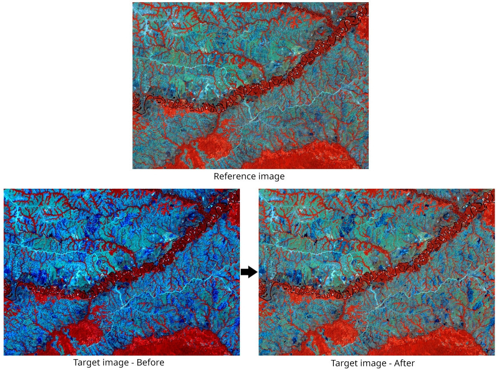

# ArrNorm

ArrNorm is a Qgis processing plugin for apply the radiometric normalization to the target image based on reference image using the IR-MAD algorithm to locate invariant/variant pixels for a relative radiometric normalization.

The algorithm takes advantage of the linear and affine invariance of the Multivariate alteration detection (MAD)
transformation to perform a relative radiometric normalization of the images involved in the transformation, using the correlation of the iteratively reweighted MAD (IR-MAD) [1]

Stop condition is set by max iteration or with a minimum no-change probability threshold. With more iterations the algorithm try to find a better match to the reference image, decreasing the delta, the plugin select the best delta for the final result. However, after several iterations the changes in the delta are imperceptible.

[1] M. J. Canty (2014): Image Analysis, Classification and Change Detection in Remote Sensing, with Algorithms for ENVI/IDL and Python (Third Revised Edition), Taylor and Francis CRC Press.

<figcaption align = "center">Fig.1 - Example of a Landsat image normalization, using a multi-year average (reference) to normalize a scene. Some remote sensing imagery pixel values are affected by different causes such as: sensor angle, sun position, clouds and seasons.</figcaption>

---

> *Note:* For uninstall/update this plugin Windows, due to some dlls that the plugin has, you must first deactivate, restart Qgis and finally update and activate.

## Source code

The official version control system repository of the plugin:
[https://github.com/SMByC/ArrNorm-Qgis-processing](https://github.com/SMByC/ArrNorm-Qgis-processing)

## Issue Tracker

Issues, ideas and enhancements: [https://github.com/SMByC/ArrNorm-Qgis-processing/issues](https://github.com/SMByC/ArrNorm-Qgis-processing/issues)

## About us

ArrNorm was developing, designed and implemented by the Group of Forest and Carbon Monitoring System (SMByC), operated by the Institute of Hydrology, Meteorology and Environmental Studies (IDEAM) - Colombia.

Author and developer: *Xavier Corredor Ll.*  
Theoretical support, tester and product verification: SMByC-PDI group

### Contact

Xavier Corredor Ll.: *xcorredorl (a) ideam.gov.co*  
SMByC: *smbyc (a) ideam.gov.co*

## License

ArrNorm is a free/libre software and is licensed under the GNU General Public License.
