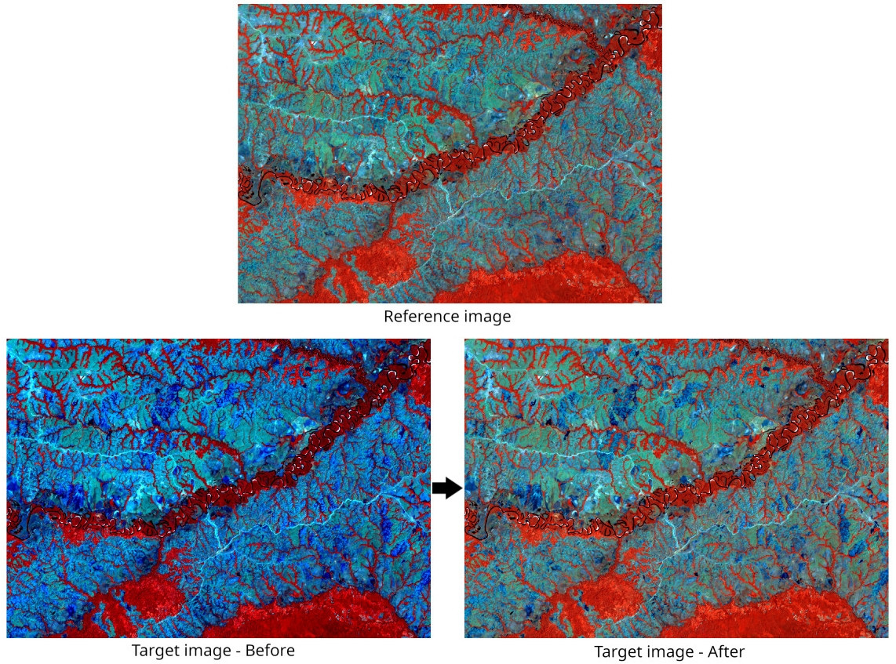

<p align="center">
  
</p>
<h1 align="center">ArrNorm</h1>

ArrNorm is a command-line tool for relative radiometric normalization of multispectral remote sensing imagery. Given a reference image and one or more target images acquired over the same area at different dates, it produces normalized outputs whose reflectance values are statistically consistent with the reference — compensating for differences caused by sensor angle, sun position, atmospheric conditions, and seasonal variation.

Normalization relies on the **IR-MAD** algorithm (Iteratively Reweighted Multivariate Alteration Detection) to automatically identify *no-change* pixels shared by both images and use them to calibrate a per-band linear transform. [[1]](#references)

## Algorithm overview

The pipeline has three main stages:

### 1. Alignment

Before any statistics are computed the reference image is reprojected and resampled onto the target's exact pixel grid (same CRS, same spatial extent, same number of pixels) using `gdal.Warp` with bilinear resampling. This guarantees pixel-for-pixel spatial coincidence, which is a hard requirement for the IR-MAD covariance computations. If the two images already share an identical grid the step is skipped.

### 2. IR-MAD — invariant pixel detection

The Multivariate Alteration Detection (MAD) transformation finds *K* pairs of linear combinations of the spectral bands — the **MAD variates** — such that each pair is maximally different between the two dates. For *K* bands the *i*-th MAD variate is:

```
MAD_i = a_i^T · X  −  b_i^T · Y
```

where **X** and **Y** are the reference and target band vectors, and the coefficient vectors **a** and **b** are the solutions of a pair of coupled generalized eigenproblems involving the between-date cross-covariance matrix. The corresponding **canonical correlation** ρᵢ measures how similar the two images are in that combination of bands: ρᵢ → 1 means no change, ρᵢ → 0 means complete change. The variance of each MAD variate is 2(1 − ρᵢ).

Under the null hypothesis of *no change*, the standardized MAD variates

```
χ² = Σ_i  (MAD_i / √(2(1 − ρᵢ)))²
```

follow a chi-squared distribution with *K* degrees of freedom. The **no-change probability** NCP = P(χ² ≥ observed) is then used as a pixel weight for the next iteration: stable pixels get weight ≈ 1, changed pixels get weight ≈ 0.

The **iterative reweighting** loop drives the covariance statistics toward being estimated entirely from invariant ground, progressively suppressing changed pixels. Two independent thresholds govern the pipeline:

- **Convergence level** τ_conv: iteration stops when δ = max|ρ_new − ρ_old| falls below 1 − τ_conv, or when the maximum number of iterations is reached. Higher values enforce tighter convergence (e.g. τ_conv = 0.99 stops when δ < 0.01). When the iteration limit is reached, the result with the smallest δ is selected automatically.

- **No-change probability threshold** τ_ncp: after IR-MAD converges, only pixels whose no-change probability NCP exceeds τ_ncp are admitted to the per-band orthogonal regression in RadCal. Higher values select fewer but more reliable invariant pixels.

### 3. RadCal — radiometric calibration

Using the no-change pixels identified by IR-MAD (those with NCP > τ_ncp), ArrNorm fits a per-band **orthogonal (total-least-squares) regression** of target onto reference:

```
Y_normalized = a + b · Y_target
```

Orthogonal regression is used because both images contain measurement noise, so minimizing residuals in both directions gives a more accurate calibration line than ordinary least squares. The coefficients are applied to the full target image to produce the normalized output.



*Fig. 1 — Example of a Landsat image normalization using a multi-year average as reference. Pixel values are affected by sensor angle, sun position, atmospheric conditions, and seasonal variation; ArrNorm compensates for all of these. Use the same display style (copy/paste style in QGIS) across all layers when comparing before and after.*

> See also the [ArrNorm](https://github.com/SMByC/ArrNorm) cli version.

## References

[1] M. J. Canty (2014): *Image Analysis, Classification and Change Detection in Remote Sensing, with Algorithms for ENVI/IDL and Python* (Third Revised Edition). Taylor & Francis / CRC Press.

The IR-MAD algorithm and the radiometric normalization procedure implemented here are described in detail in Chapter 9 of that book. The iterative reweighting scheme, the use of the chi-squared no-change probability as pixel weights, and the orthogonal regression calibration all follow Canty's formulation directly.

## About

ArrNorm was designed and implemented by the Forest and Carbon Monitoring System group (SMByC), operated by the Institute of Hydrology, Meteorology and Environmental Studies (IDEAM) — Colombia.

**Author and developer:** Xavier C. Llano <xavier.corredor.llano@gmail.com>  
**Theoretical support, testing and product verification:** SMByC-PDI group

## License

ArrNorm is free/libre software, licensed under the GNU General Public License v3 (GPLv3).
